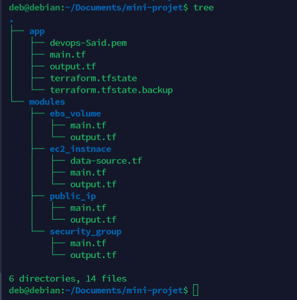

# Mini projet terraform

Notre projet vise à simplifier et automatiser le provisionnement d'infrastructures AWS en utilisant Terraform, un outil open-source de gestion de l'infrastructure en tant que code. En combinant les avantages d'AWS et la puissance de Terraform, notre objectif est de permettre aux équipes de déploiement et d'exploitation d'infrastructures de créer rapidement et de manière cohérente des ressources clés, telles que des instances EC2, des volumes EBS, des adresses IP publiques et des groupes de sécurité.


## Prérequis

Ce projet est réalisé sous Debian, mais il est possible d'apporter de légères modifications si vous utilisez un système d'exploitation différent.

```bash
#Pour télécharger la version 0.15.4, vous pouvez utiliser la commande suivante 
wget https://releases.hashicorp.com/terraform/0.15.4/terraform_0.15.4_linux_amd64.zip
#Une fois le téléchargement terminé, installez le package "unzip" si ce n'est pas déjà fait
sudo apt-get install unzip
#Décompressez le fichier Terraform que vous avez téléchargé 
unzip terraform_0.15.4_linux_amd64.zip
#Déplacez l'exécutable Terraform vers un répertoire inclus dans votre variable d'environnement "PATH" :
sudo mv terraform /usr/local/bin/
#Vérifiez si Terraform est correctement installé en exécutant la commande suivante
terraform version
```

## Utilisation

Tout d’abord, il faut bien préciser votre région, access_key et secret_key. Vous pouvez trouvez ça dans le paramètre de votre compte AWS.

```hcl
  region = "us-east-1"
  access_key = "Votre access key"
  secret_key = "Votre secret key"
```

Ensuiste, la clé privé votre_private_key.pem (avec une autorisation 400), et faire la modification suivante : 
```hcl
  keyname = "votre_private_key"
```
Puis dans la connexion ssh  :
```hcl
  private_key = file("chemin_de_votre_fichier/votre_private_key.pem"
```
Par conséquent, vous devez prendre en considération le chémin par défaut si vous n'avez par changer le chemin :



Le fichier terraform.state est le fichier principal qui contient toutes les informations sur votre infrastructure actuelle. Il répertorie les ressources que vous avez créées, leurs configurations, leurs dépendances et leurs états. Ce fichier est généralement stocké dans un système de contrôle de version, tel que Git, pour permettre le travail collaboratif et le suivi des modifications.

Le fichier terraform.state.backup est une sauvegarde du fichier terraform.state précédent. Il est automatiquement créé par Terraform lorsqu'il met à jour l'état de votre infrastructure. Cette sauvegarde est utile en cas de problème avec le fichier principal, vous permettant de restaurer une version précédente de l'état de votre infrastructure.

Ces fichiers sont crées automatiquement après exécution des commandes suivante.

## Exécution des commandes

Une fois adapté votre code, il faut exécuter ces commandes pour déployer vos ressources 

```bash
  # Pour initialiser 
  terraform init
  
  # Pour valider votre configuration au niveau de code 
  terraform validate
  
  #Pour voir le plan d'exécution
  terraform plan
  
  #Si d'après le plan, tout est bien , appliquer votre configuration
  terraform apply
  
  #Si vous avez fini d'utiliser les ressources, vous pouvez détruire les ressources
  terraform destroy
```

## Contribution

Nous accueillons avec enthousiasme toute contribution à notre projet ! Voici comment vous pouvez contribue: 

1. cloner le dépot 

```bash
git clone https://github.com/Said-IT/mini-projet_terraform.git
cd mini-projet_terraform
```

2. Ajouter de nouvelles fonctionnalités ou améliorer les fonctionnalités existantes :

```bash
git checkout -b nom-de-ma-branche
```

3. Soumettre une demande de pull

- Une fois que vous avez terminé vos modifications, soumettez une demande de pull (PR) sur GitHub.
- Décrivez clairement les modifications apportées, en mettant en évidence les fonctionnalités - ajoutées ou améliorées.
- Assurez-vous que votre PR est cohérente avec les conventions de codage du projet.
- Les mainteneurs du projet examineront votre PR, fourniront des commentaires et fusionneront votre contribution si elle est acceptée.


4. Signaler des problèmes ou des suggestions d'amélioration

- Si vous rencontrez des problèmes lors de l'utilisation du projet ou si vous avez des suggestions d'amélioration, veuillez les signaler en créant un problème sur GitHub.
- Décrivez le problème ou la suggestion de manière claire et détaillée.
- Les mainteneurs du projet examineront votre problème ou votre suggestion et y répondront dans les plus brefs délais.

Nous apprécions votre contribution et votre participation active à notre projet. Votre expertise et votre engagement contribueront à améliorer l'automatisation du provisionnement d'infrastructures AWS avec Terraform.
